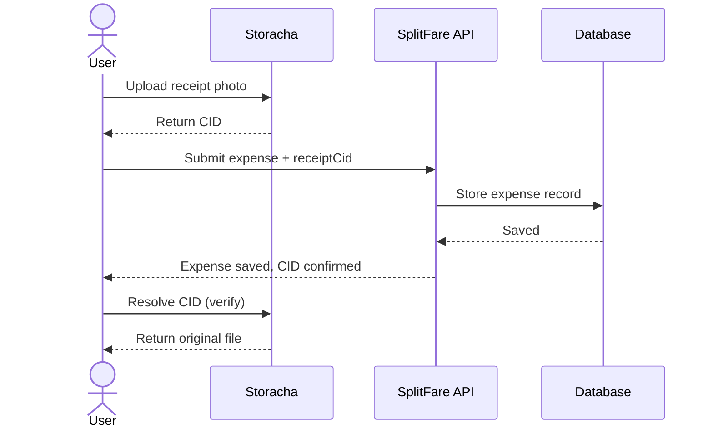
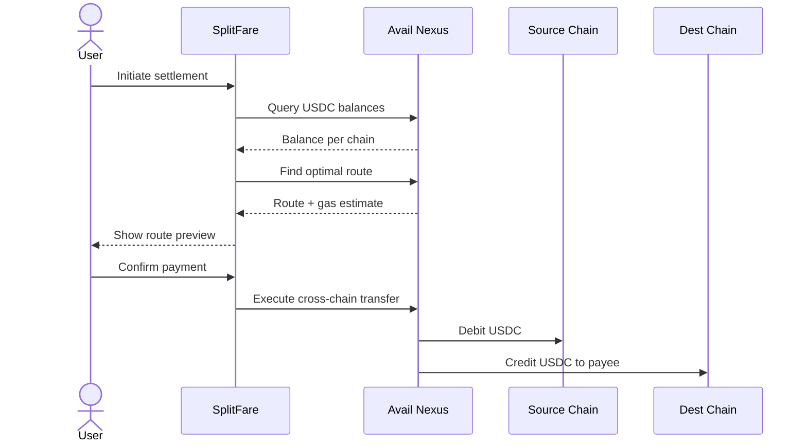
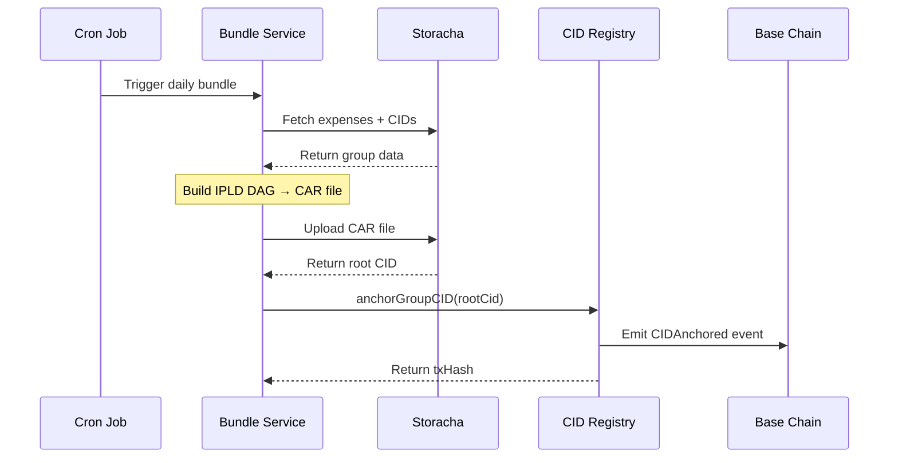

# SplitFare

> **Splitwise meets on-chain settlements**, expense splitting with tamper-proof receipts, cross-chain USDC payments, and data you truly own.

[](https://opensource.org/licenses/MIT)
[](https://nextjs.org)
[](https://storacha.network)

---

## What is SplitFare?

SplitFare is a Web3-native Progressive Web App (PWA) for splitting expenses with friends. Every receipt is stored permanently on decentralized storage, every settlement is verifiable on-chain, and every payment moves seamlessly across chains, all without users needing to understand any of it.

**The problem with existing expense splitters:**
- No proof that someone actually paid what they claim
- All data lives in centralized databases you don't control
- No tamper-proof record linking payments back to expenses
- USDC scattered across chains makes settling frustrating

**SplitFare solves all of this** the crypto is invisible, but every record is provable.

---

## Features

### 💸 Expense Splitting
- Equal, exact, percentage, and shares-based splits
- Multi-step expense creation with category tagging
- Full expense history with search, filters, and date grouping
- Debt simplification algorithm to minimize settlement transactions

### 📷 Receipt-Backed Expenses
- Attach photo receipts to any expense via camera or file picker
- Receipts stored permanently on [Storacha](https://storacha.network) (IPFS + Filecoin)
- Each receipt gets an immutable CID anyone in the group can verify it
- "Verify on IPFS" link for every receipt

### ⛓️ Cross-Chain Settlements
- Settle debts in USDC across Base, Optimism, Arbitrum, Polygon, Ethereum Sepolia, and Monad
- Powered by [Avail Nexus](https://availproject.org), no manual bridging required
- Nexus automatically aggregates balances and routes payments optimally
- Every settlement generates a structured manifest anchored to Storacha

### 🔐 Tamper-Proof Records
- Settlement manifests link payer, payee, amount, txHash, and all receipt CIDs
- Group data periodically bundled into CAR files and uploaded to Storacha
- Root CID anchored on-chain via `SplitFareCIDRegistry` smart contract
- One cheap transaction proves hundreds of records, independently verifiable forever

### 🪪 Web3 Identity
- Sign in with Google, Email, Twitter/X, or Discord via [Privy](https://privy.io)
- Embedded wallet created automatically on first login
- ENS subdomains: every user gets `<name>.splitfare.eth`
- UCAN delegation for per-group Storacha access control

### 📦 Data Ownership
- Export complete group data as a Storacha-hosted CAR archive
- JSON, CSV, and PDF export formats also available
- Your data resolves independently of SplitFare's servers
- Shared media spaces per group stored on Storacha

---

## Tech Stack

| Layer | Technology |
|---|---|
| Frontend | Next.js 14 (App Router), TypeScript, Tailwind CSS |
| Auth | [Privy](https://privy.io) (social login + embedded wallets) |
| Storage | [Storacha](https://storacha.network) (IPFS + Filecoin) |
| Payments | [Avail Nexus](https://availproject.org) (cross-chain USDC) |
| Identity | [ENS](https://ens.domains) subdomains (`*.splitfare.eth`) |
| Smart Contracts | Solidity + Foundry, deployed on Base Sepolia |
| Database | [Supabase](https://supabase.com) (PostgreSQL) |
| PWA | Workbox service worker, Web Push notifications |
| Deployment | Vercel + Vercel Cron Jobs |

---

## Architecture Overview

```
User (PWA)
    │
    ├── Privy Auth ──────────────────► ENS Subdomain
    │
    ├── Expense Creation
    │       └── Receipt Upload ──────► Storacha (CID stored in DB)
    │
    ├── Settlement Flow
    │       ├── Avail Nexus ─────────► Cross-chain USDC transfer
    │       └── Manifest Generation ► Storacha (manifestCid stored in DB)
    │
    └── Periodic Bundling (Cron)
            ├── CAR File Builder ────► Storacha (rootCid returned)
            └── On-chain Anchor ─────► SplitFareCIDRegistry (Base Sepolia)
```
---

## Sequence Diagrams

### Receipt Storage Flow

When a user attaches a receipt, the photo is uploaded directly to Storacha from the client. The returned CID is stored alongside the expense not the file itself, so anyone in the group can independently resolve and verify the original, unaltered image.



### Cross-Chain Settlement Flow

Avail Nexus aggregates USDC balances across all supported chains, selects the cheapest route, and executes the transfer. SplitFare shows the user a route preview before any funds move.



### Group Bundle & On-Chain Anchoring Flow

Once a day, a cron job collects all group data, builds an IPLD DAG as a CAR file, uploads it to Storacha, and anchors the root CID on Base. One transaction creates a trustless proof of potentially hundreds of records.



---

## Getting Started

### Prerequisites

- Node.js 20+
- [Supabase](https://supabase.com) project (free tier works)
- [Storacha](https://storacha.network) account
- [Privy](https://privy.io) app ID
- (Optional) Avail Nexus API key for cross-chain settlements

### Installation

```bash
# Clone the repository
git clone https://github.com/your-org/splitfare.git
cd splitfare

# Install dependencies
npm install

# Copy environment variables
cp .env.example .env.local
```

### Environment Variables

Fill in `.env.local` with your credentials:

```env
# Supabase
NEXT_PUBLIC_SUPABASE_URL=https://your-project.supabase.co
NEXT_PUBLIC_SUPABASE_ANON_KEY=your-anon-key
SUPABASE_SERVICE_ROLE_KEY=your-service-role-key

# Privy
NEXT_PUBLIC_PRIVY_APP_ID=your-privy-app-id
PRIVY_APP_SECRET=your-privy-app-secret

# Storacha
STORACHA_PRINCIPAL=your-storacha-principal
STORACHA_PROOF=your-storacha-proof

# ENS
ENS_RESOLVER_ADDRESS=0x...
ENS_REGISTRY_ADDRESS=0x...

# Avail Nexus
NEXUS_API_KEY=your-nexus-api-key

# Smart Contract
REGISTRY_CONTRACT_ADDRESS=0x...
BASE_RPC_URL=https://sepolia.base.org

# App
NEXT_PUBLIC_APP_URL=http://localhost:3000
VAPID_PUBLIC_KEY=...
VAPID_PRIVATE_KEY=...
```

See `.env.example` for the full list with descriptions.

### Database Setup

```bash
# Run migrations via Supabase CLI
supabase db push

# Or apply migrations directly
supabase migration up
```

### Run Development Server

```bash
npm run dev
```

Open [http://localhost:3000](http://localhost:3000).

---

## Project Structure

```
splitfare/
├── app/                    # Next.js App Router pages and API routes
│   ├── (dashboard)/        # Authenticated app shell
│   ├── (marketing)/        # Landing page
│   ├── api/                # API route handlers
│   ├── groups/             # Group pages (dashboard, expenses, settle)
│   ├── join/               # Invite link handler
│   ├── login/              # Auth page
│   └── onboarding/         # New user onboarding flow
├── components/             # Reusable React components
│   ├── ui/                 # Base design system components
│   ├── expense-form/       # Multi-step expense creation
│   ├── settle-flow/        # Settlement UI steps
│   └── notifications/      # Notification components
├── contracts/              # Foundry smart contract project
│   ├── src/                # Solidity source files
│   ├── test/               # Foundry tests
│   └── script/             # Deploy scripts
├── docs/                   # Extended documentation
├── e2e/                    # Playwright end-to-end tests
├── hooks/                  # React custom hooks
├── lib/                    # Utilities and service clients
│   ├── storacha.ts         # Storacha client
│   ├── nexus.ts            # Avail Nexus client
│   ├── ens.ts              # ENS utilities
│   ├── splits.ts           # Split calculation algorithms
│   ├── balances.ts         # Balance calculator
│   └── debt-simplifier.ts  # Debt graph minimizer
├── supabase/               # Supabase migrations and config
├── services/               # Business logic services
│   ├── bundle.ts           # CAR file bundling
│   ├── anchoring.ts        # On-chain CID anchoring
│   ├── manifest-generator.ts
│   └── settlement-executor.ts
└── __tests__/              # Unit and integration tests
```

---

## Smart Contracts

The `SplitFareCIDRegistry` contract anchors group data root CIDs on-chain.

```solidity
// Anchor a group's data bundle
function anchorGroupCID(bytes32 groupId, string calldata cid, uint256 recordCount) external

// Retrieve the latest anchor for a group
function getLatestAnchor(bytes32 groupId) external view returns (Anchor memory)

// Verify a specific CID was anchored
function verifyCID(bytes32 groupId, string calldata cid) external view returns (bool)
```

**Deployed Contracts:**

| Network | Address |
|---|---|
| Base Sepolia | `0x...` |

### Building & Testing Contracts

```bash
cd contracts
forge build
forge test
forge script script/Deploy.s.sol --rpc-url base_sepolia --broadcast
```

---

## How Storacha is Used

SplitFare uses Storacha across five core features:

1. **Receipt Storage**- Receipt photos are uploaded to Storacha on expense creation. The returned CID is stored with the expense record so any group member can verify the original, unaltered file.

2. **Settlement Manifests**- After every on-chain USDC settlement, a structured JSON manifest (payer, payee, amount, txHash, linked expense and receipt CIDs) is uploaded to Storacha, creating an end-to-end verifiable chain.

3. **Group Bundles & On-Chain Anchoring**- Periodically, all group data is bundled into a CAR file, uploaded to Storacha, and the root CID is anchored on-chain. One transaction proves hundreds of records.

4. **Data Export**- Users can export their complete group history as a Storacha-hosted CAR archive they own independently.

5. **Shared Media Spaces**- Groups maintain shared Storacha spaces for trip photos and documents, with UCAN delegation for access control.

---

## Development

### Running Tests

```bash
# Unit and integration tests
npm test

# Watch mode
npm run test:watch

# E2E tests (requires running dev server)
npm run test:e2e

# Smart contract tests
cd contracts && forge test
```

### Code Quality

```bash
npm run lint        # ESLint
npm run typecheck   # TypeScript
npm run format      # Prettier
```

Commits must follow [Conventional Commits](https://www.conventionalcommits.org), enforced via commitlint and Husky.


## Contributing

1. Fork the repository
2. Create a feature branch: `git checkout -b feat/your-feature`
3. Commit with conventional commits: `git commit -m "feat: add your feature"`
4. Push and open a pull request using the PR template

---

## Acknowledgements

Built with [Storacha](https://storacha.network), [Avail Nexus](https://availproject.org), [Privy](https://privy.io), [ENS](https://ens.domains), and deployed on [Base](https://base.org).
